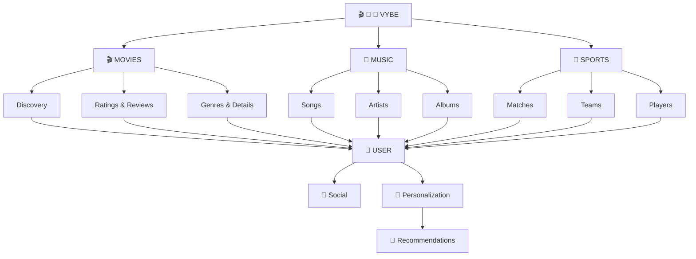
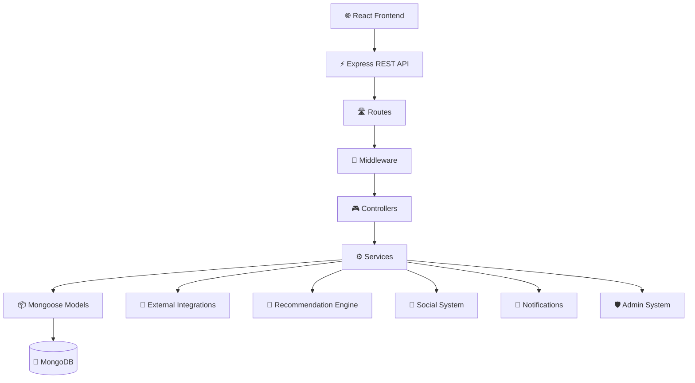
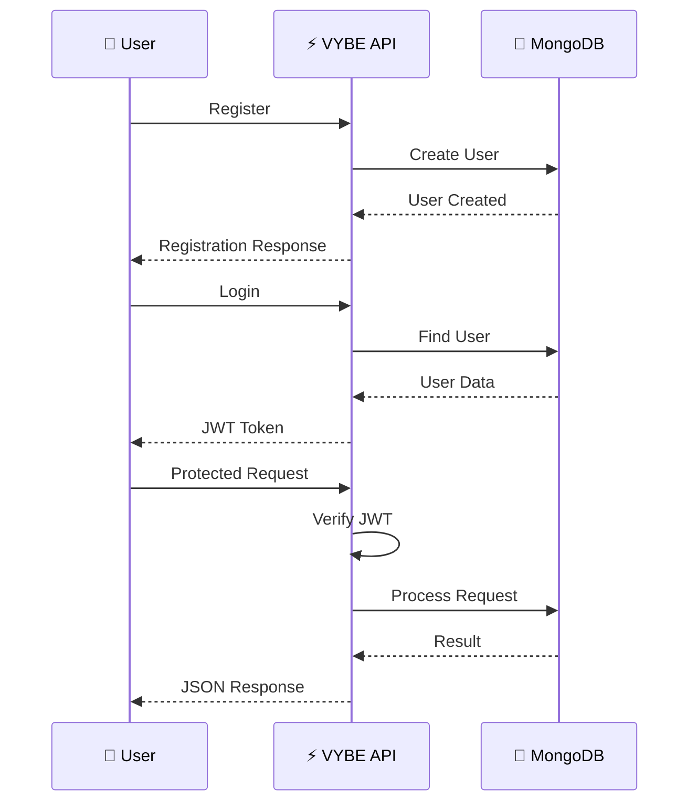
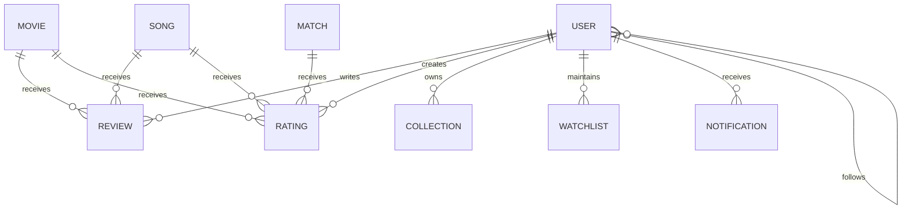
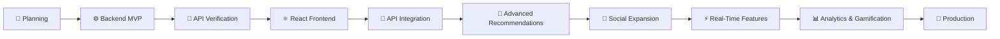

<div align="center">

# 🎬 VYBE

### **One Platform. Every Vibe.**

**A unified social discovery platform for Movies, Music & Sports**

*Discover • Rate • Review • Follow • Share your vibe.*

<br/>

[](https://github.com/Dhodiapreet/VYBE)
[](https://nodejs.org/)
[](https://expressjs.com/)
[](https://www.mongodb.com/)
[](https://mongoosejs.com/)
[](https://jwt.io/)
[](https://jestjs.io/)
[](#-current-project-status)

</div>

---

## 📌 Project Snapshot

| Category | Details |
|:---|:---|
| **Project** | VYBE |
| **Type** | Social Discovery Platform |
| **Domains** | Movies • Music • Sports |
| **Architecture** | Modular Monolith |
| **Backend** | Node.js + Express.js |
| **Database** | MongoDB + Mongoose |
| **Authentication** | JWT |
| **Validation** | Zod |
| **Security** | bcryptjs • Helmet • CORS • Rate Limiting |
| **Testing** | Jest + Supertest |
| **API Version** | `/api/v1` |
| **Backend Status** | 🟢 Completed & Verified |
| **API Verification** | 🟢 30 / 30 Passed |
| **Frontend Status** | 🔵 Next Phase |

---

# 📖 About VYBE

**VYBE** is a unified social discovery platform designed to bring **Movies, Music, and Sports** together in one personalized ecosystem.

Instead of switching between separate platforms to discover entertainment and sports content, VYBE aims to provide one place where users can:

- 🎬 Discover Movies
- 🎵 Discover Music
- 🏏 Explore Sports
- ⭐ Rate content
- 📝 Write reviews
- ❤️ Save favorites
- 📌 Manage watchlists
- 📚 Create collections
- 👥 Follow other users
- 🔔 Receive notifications
- 🤖 Get personalized recommendations
- 🔎 Search across content categories
- 🛡️ Access role-based administration

### 🎯 Core Idea

> **One platform. Every vibe.**

A user's interests are connected across different content types.

For example:

```text
🎬 Watch a Movie
       ↓
⭐ Rate it
       ↓
📝 Review it
       ↓
🎵 Discover related Music
       ↓
🎤 Explore an Artist
       ↓
🏏 Follow a Sports Team
       ↓
📚 Add everything to a Collection
```

---

# ❗ Problem Statement

Modern entertainment discovery is fragmented across multiple platforms.

A user may need different applications for:

```text
🎬 Movies
+
🎵 Music
+
🏏 Sports
+
⭐ Ratings & Reviews
+
👥 Social Discovery
```

This creates a disconnected experience.

### Problems VYBE aims to address

- Fragmented content discovery
- Separate entertainment profiles
- Limited cross-domain personalization
- Disconnected social interaction
- Difficulty organizing different types of content
- Recommendations limited to individual platforms

---

# 💡 Proposed Solution

VYBE combines multiple content ecosystems into a single platform.



---

# ✨ Highlights

| Area | What is Included | Status |
|:---|:---|:---:|
| 🎬 **Movies** | Movie discovery, details and seeded content | 🟢 |
| 🎵 **Music** | Songs, artists and albums | 🟢 |
| 🏏 **Sports** | Matches, teams and players | 🟢 |
| ⭐ **Ratings** | User ratings with duplicate prevention | 🟢 |
| 📝 **Reviews** | Create and retrieve reviews | 🟢 |
| 📚 **Collections** | Personal content collections | 🟢 |
| 📌 **Watchlist** | Save content for later | 🟢 |
| 👥 **Social** | User follow system | 🟢 |
| 🔎 **Search** | Unified content search | 🟢 |
| 🤖 **Recommendations** | Rule-based recommendations | 🟢 |
| 🎲 **Surprise Me** | Randomized discovery | 🟢 |
| 🔔 **Notifications** | User notification system | 🟢 |
| 🛡️ **Admin** | User management & role-based access | 🟢 |
| 🔐 **Authentication** | JWT-based authentication | 🟢 |
| 🔒 **Security** | Hashing, validation, rate limiting & middleware | 🟢 |
| 🧪 **API Testing** | 30/30 verified endpoints | 🟢 |
| 🗄️ **Database** | MongoDB + Mongoose | 🟢 |
| 🏗️ **Architecture** | Modular Monolith | 🟢 |

---

# 🏗️ System Architecture

VYBE currently follows a **Modular Monolith Architecture**.

The backend remains one deployable application while functionality is separated into independent domain modules.



---

# 🔄 Request Flow

Every API request follows a predictable flow:

```text
┌──────────────────────┐
│   🌐 Client Request  │
└──────────┬───────────┘
           ↓
┌──────────────────────┐
│    🛣️ API Routes     │
└──────────┬───────────┘
           ↓
┌──────────────────────┐
│   🔐 Middleware      │
│                      │
│ • Authentication     │
│ • Authorization      │
│ • Validation         │
│ • Rate Limiting      │
│ • Security           │
└──────────┬───────────┘
           ↓
┌──────────────────────┐
│   🎮 Controllers     │
└──────────┬───────────┘
           ↓
┌──────────────────────┐
│    ⚙️ Services       │
│   Business Logic     │
└──────────┬───────────┘
           ↓
┌──────────────────────┐
│ 📦 Mongoose Models   │
└──────────┬───────────┘
           ↓
┌──────────────────────┐
│    🍃 MongoDB        │
└──────────────────────┘
```

### Architectural Principle

```text
Routes
  ↓
Controllers
  ↓
Services
  ↓
Models
  ↓
MongoDB
```

### Design Philosophy

- **Thin Controllers** — Handle HTTP requests and responses.
- **Service Layer** — Contains business logic.
- **Models** — Define database structures and constraints.
- **Middleware** — Handles cross-cutting concerns.
- **Utilities** — Reusable application functionality.
- **Modules** — Keep domain functionality separated.

---

# 📂 Project Structure

```text
VYBE/
│
├── src/
│   │
│   ├── config/
│   │   └── db.js
│   │
│   ├── middleware/
│   │   ├── auth.middleware.js
│   │   └── error.middleware.js
│   │
│   ├── utils/
│   │   ├── ApiError.js
│   │   ├── apiResponse.js
│   │   ├── asyncHandler.js
│   │   └── seed.js
│   │
│   ├── modules/
│   │   │
│   │   ├── auth/
│   │   │   ├── auth.controller.js
│   │   │   ├── auth.routes.js
│   │   │   └── auth.service.js
│   │   │
│   │   ├── users/
│   │   │   ├── user.model.js
│   │   │   ├── user.controller.js
│   │   │   └── user.routes.js
│   │   │
│   │   ├── movies/
│   │   │   ├── movie.model.js
│   │   │   ├── movie.controller.js
│   │   │   ├── movie.service.js
│   │   │   └── movie.routes.js
│   │   │
│   │   ├── music/
│   │   │   ├── song/
│   │   │   ├── artist/
│   │   │   └── album/
│   │   │
│   │   ├── sports/
│   │   │   ├── match/
│   │   │   ├── team/
│   │   │   └── player/
│   │   │
│   │   ├── reviews/
│   │   ├── ratings/
│   │   ├── collections/
│   │   ├── social/
│   │   └── search/
│   │
│   ├── app.js
│   └── server.js
│
├── tests/
│   └── api.test.js
│
├── .env
├── .env.example
├── .gitignore
├── jest.config.js
├── package.json
├── README.md
└── VYBE_Postman_Collection.json
```

> **Architecture Note:** The project uses a feature/module-oriented structure so new functionality can be added without unnecessarily affecting existing modules.

---

# 🧩 Backend Modules

## 🔐 Authentication

Responsible for:

- User registration
- User login
- Password hashing
- JWT generation
- JWT verification
- Protected routes
- Current-user authentication

### Endpoints

```http
POST /api/v1/auth/register
POST /api/v1/auth/login
GET  /api/v1/auth/me
```

---

## 👤 Users

The user module manages:

- User information
- Profiles
- User status
- User relationships
- User activity

Users form the central entity of the VYBE ecosystem.

---

## 🎬 Movies

Movie functionality provides:

- Movie discovery
- Movie listing
- Movie details
- Genres
- Ratings
- Reviews
- Movie-related interactions

### Endpoints

```http
GET /api/v1/movies
GET /api/v1/movies/:id
```

---

## 🎵 Music

The Music ecosystem is organized into:

```text
Music
├── Songs
├── Artists
└── Albums
```

### Endpoints

```http
GET /api/v1/music/songs
GET /api/v1/music/songs/:id
GET /api/v1/music/artists
GET /api/v1/music/albums
```

### Future Expansion

- Artist following
- Playlists
- Music recommendations
- Genre-based discovery
- Personalized music feeds

---

## 🏏 Sports

The Sports ecosystem contains:

```text
Sports
├── Matches
├── Teams
└── Players
```

### Endpoints

```http
GET /api/v1/sports/matches
GET /api/v1/sports/matches/live
GET /api/v1/sports/teams
GET /api/v1/sports/players
```

The architecture can later support live sports APIs and real-time updates.

---

## 📝 Reviews

Users can create and retrieve reviews for supported content.

```http
GET  /api/v1/reviews
POST /api/v1/reviews
```

Protected operations require authentication.

---

## ⭐ Ratings

VYBE supports a quick-rating concept:

```text
🔥 PERFECT
❤️ LOVED_IT
👍 GOOD
😐 AVERAGE
⏭️ SKIP
```

Ratings can become signals for the user's taste profile and recommendation engine.

```http
POST /api/v1/ratings
```

Duplicate rating behavior is controlled at the application/database level.

---

## 📚 Collections

Users can create personal collections.

Example:

```text
📚 Weekend Vibes
│
├── 🎬 Interstellar
├── 🎵 Favorite Song
└── 🏏 Favorite Match
```

### Endpoints

```http
GET  /api/v1/collections
POST /api/v1/collections
```

---

## 📌 Watchlist

Authenticated users can save content for later.

```http
GET  /api/v1/watchlist
POST /api/v1/watchlist
```

The architecture can later support:

- Movies
- TV shows
- Music
- Sports events

---

## 👥 Social System

VYBE includes a basic social relationship system.

Users can follow other users and build their social discovery network.

```http
POST /api/v1/social/follow/:userId
```

The API also prevents invalid self-following behavior.

### Planned Social Features

```text
Followers
Following
Activity Feed
Likes
Comments
Shares
Blocking
Reporting
```

---

## 🔎 Universal Search

VYBE provides a unified search endpoint:

```http
GET /api/v1/search?q=movie
```

Conceptually:

```text
              🔎 Search
                  │
        ┌─────────┼─────────┐
        ↓         ↓         ↓
     Movies     Music     Sports
        │         │         │
        └─────────┼─────────┘
                  ↓
        🔎 Unified Results
```

---

## 🤖 Recommendation System

The current recommendation engine uses **rule-based logic**.

Potential recommendation signals include:

- User ratings
- Favorites
- Watchlist
- Genres
- Content categories
- User interactions

### Endpoints

```http
GET /api/v1/recommendations
GET /api/v1/recommendations/surprise
```

### Recommendation Evolution

```text
Rule-Based
    ↓
Content-Based
    ↓
Collaborative Filtering
    ↓
Hybrid Recommendation
    ↓
Machine Learning
```

---

## 🔔 Notifications

The notification module provides user notification data.

```http
GET /api/v1/notifications
```

Future notification events may include:

- New followers
- Likes
- Comments
- Recommendations
- Sports updates
- System notifications

---

## 🛡️ Admin System

VYBE contains protected administrative APIs.

### Current Capabilities

- View users
- Manage user status
- Monitor platform activity
- Role-based access

### Endpoints

```http
GET   /api/v1/admin/users
PATCH /api/v1/admin/users/:id/status
```

Admin routes require:

```text
Valid JWT
   +
ADMIN role
```

A normal user attempting to access an Admin-only endpoint receives:

```text
HTTP 403 Forbidden
```

---

# 🔐 Authentication & Authorization

VYBE uses **JWT-based authentication**.



Protected APIs use:

```http
Authorization: Bearer <JWT_TOKEN>
```

---

# 🗄️ Database Architecture

VYBE uses:

## **MongoDB + Mongoose**

Conceptually, the database contains:

```text
MongoDB
│
├── Users
├── Movies
├── Songs
├── Artists
├── Albums
├── Matches
├── Teams
├── Players
├── Reviews
├── Ratings
├── Collections
├── Watchlist
├── Social Relationships
└── Notifications
```

### Database Flow

```text
VYBE API
   ↓
Mongoose ODM
   ↓
MongoDB
```

### Local Development URI

```text
mongodb://127.0.0.1:27017/vybe
```

---

# 🔗 Data Relationships



---

# 📡 API Architecture

All APIs use versioning:

```text
/api/v1/
```

Examples:

```text
/api/v1/auth/login
/api/v1/movies
/api/v1/music/songs
/api/v1/sports/matches
/api/v1/search?q=...
```

API versioning makes future API changes easier without immediately breaking existing clients.

---

# 📋 API Endpoints

| Module | Method | Endpoint | Auth |
|:---|:---:|:---|:---:|
| Health | `GET` | `/api/v1/health` | ❌ |
| Auth | `POST` | `/api/v1/auth/register` | ❌ |
| Auth | `POST` | `/api/v1/auth/login` | ❌ |
| Auth | `GET` | `/api/v1/auth/me` | ✅ |
| Movies | `GET` | `/api/v1/movies` | ❌ |
| Movies | `GET` | `/api/v1/movies/:id` | ❌ |
| Music | `GET` | `/api/v1/music/songs` | ❌ |
| Music | `GET` | `/api/v1/music/songs/:id` | ❌ |
| Music | `GET` | `/api/v1/music/artists` | ❌ |
| Music | `GET` | `/api/v1/music/albums` | ❌ |
| Sports | `GET` | `/api/v1/sports/matches` | ❌ |
| Sports | `GET` | `/api/v1/sports/matches/live` | ❌ |
| Sports | `GET` | `/api/v1/sports/teams` | ❌ |
| Sports | `GET` | `/api/v1/sports/players` | ❌ |
| Search | `GET` | `/api/v1/search?q=...` | ❌ |
| Reviews | `GET` | `/api/v1/reviews` | ❌ |
| Reviews | `POST` | `/api/v1/reviews` | ✅ |
| Ratings | `POST` | `/api/v1/ratings` | ✅ |
| Collections | `GET` | `/api/v1/collections` | ✅ |
| Collections | `POST` | `/api/v1/collections` | ✅ |
| Watchlist | `GET` | `/api/v1/watchlist` | ✅ |
| Watchlist | `POST` | `/api/v1/watchlist` | ✅ |
| Social | `POST` | `/api/v1/social/follow/:userId` | ✅ |
| Recommendations | `GET` | `/api/v1/recommendations` | ✅ |
| Recommendations | `GET` | `/api/v1/recommendations/surprise` | ✅ |
| Notifications | `GET` | `/api/v1/notifications` | ✅ |
| Admin | `GET` | `/api/v1/admin/users` | 🛡️ |
| Admin | `PATCH` | `/api/v1/admin/users/:id/status` | 🛡️ |

---

# ❤️ API Response Philosophy

The backend uses controlled JSON responses.

Example:

```json
{
  "success": true,
  "message": "API is healthy",
  "data": {
    "environment": "development",
    "timestamp": "..."
  }
}
```

A consistent response structure makes frontend integration easier.

---

# 🌱 Seed / Demo Data

The project includes a seed system for reliable development and demonstrations.

The seed data contains representative:

```text
👤 Users
🛡️ Admin User
🎬 Movies
🎵 Music
🏏 Sports Data
⭐ Ratings
📝 Reviews
👥 Social Interactions
```

Run:

```bash
npm run seed
```

This prepares the local MongoDB database with demonstration data.

---

# 🛡️ Security

Security is treated as a core backend requirement.

### Implemented Security

- 🔐 Password hashing using bcrypt
- 🎟️ JWT authentication
- 🛡️ Role-based authorization
- 🚦 Rate limiting
- 🪖 Helmet security headers
- 🌐 CORS configuration
- 📦 Request body size limits
- ✅ Input validation
- 🧹 Centralized error handling
- 🔑 Environment-based secrets
- 🚫 Unauthorized Admin protection
- 🗃️ Database-level uniqueness constraints

### Authentication Flow

```text
                 👤 USER
                    │
          ┌─────────┴─────────┐
          ↓                   ↓
      REGISTER               LOGIN
          │                   │
          ↓                   ↓
   Password Hash        Verify Password
          │                   │
          ↓                   ↓
       MongoDB             JWT Token
                              │
                              ↓
                     Protected API
```

---

# 🔑 Environment Configuration

Create a local `.env` file:

```env
PORT=5000
NODE_ENV=development

MONGODB_URI=mongodb://127.0.0.1:27017/vybe

JWT_SECRET=change-this-to-a-long-random-secret
JWT_EXPIRES_IN=7d
```

### ⚠️ Never Commit Secrets

Never commit:

```text
.env
JWT secrets
Database passwords
API keys
Access tokens
Private credentials
```

The repository should contain:

```text
.env.example
```

with placeholder values only.

---

# 🧪 Testing & Verification

The backend has been runtime-verified against a running local MongoDB instance.

## 🟢 Latest Verification

```text
╔══════════════════════════════════════╗
║        VYBE BACKEND TEST             ║
╠══════════════════════════════════════╣
║ Total Endpoints Tested : 30          ║
║ Passed                 : 30          ║
║ Failed                 : 0           ║
║ Broken Endpoints       : 0           ║
╚══════════════════════════════════════╝
```

### Verification Result

# 🟢 30 / 30 Endpoints Passed

### Verified Areas

```text
✅ Health Check
✅ Registration
✅ Login
✅ Protected Authentication
✅ Movies
✅ Music
✅ Sports
✅ Search
✅ Reviews
✅ Ratings
✅ Collections
✅ Watchlist
✅ Social
✅ Recommendations
✅ Notifications
✅ Admin Authorization
✅ Error Handling
✅ Invalid ObjectId Handling
```

### HTTP Status Verification

```text
200 OK
201 Created
400 Bad Request
401 Unauthorized
403 Forbidden
500 Internal Server Error
```

The verification also covers unauthenticated and unauthorized request handling.

---

# 📮 Postman

The repository includes:

```text
VYBE_Postman_Collection.json
```

Import the collection into Postman to test the available APIs.

For protected APIs:

```text
Authorization
      ↓
Bearer Token
      ↓
<JWT_TOKEN>
```

---

# 💻 Tech Stack

| Technology | Purpose |
|:---|:---|
| **Node.js** | JavaScript runtime |
| **Express.js** | REST API framework |
| **MongoDB** | NoSQL database |
| **Mongoose** | MongoDB ODM |
| **JWT** | Authentication |
| **bcryptjs** | Password hashing |
| **Zod** | Request validation |
| **Helmet** | Security headers |
| **CORS** | Cross-origin request handling |
| **Jest** | Automated testing |
| **Supertest** | API testing |
| **Nodemon** | Development server |
| **Git** | Version control |
| **GitHub** | Collaboration |

---

# 🚀 Getting Started

## 1. Prerequisites

Install:

- Node.js 20+
- npm
- MongoDB Community Server
- Git
- Postman *(recommended)*

Verify Node.js:

```bash
node --version
```

Verify npm:

```bash
npm --version
```

Verify MongoDB:

```bash
mongod --version
```

---

## 2. Clone Repository

```bash
git clone https://github.com/Dhodiapreet/VYBE.git
cd VYBE
```

---

## 3. Install Dependencies

```bash
npm install
```

---

## 4. Configure Environment

Create:

```text
.env
```

Use `.env.example` as the safe template.

```env
PORT=5000
NODE_ENV=development
MONGODB_URI=mongodb://127.0.0.1:27017/vybe
JWT_SECRET=change-this-to-a-long-random-secret
JWT_EXPIRES_IN=7d
```

---

## 5. Start MongoDB

Make sure MongoDB is running.

### Windows

```powershell
Get-Service MongoDB
```

Expected:

```text
Status     Name
------     ----
Running    MongoDB
```

---

## 6. Seed Database

```bash
npm run seed
```

This inserts the demonstration data.

---

## 7. Start Development Server

```bash
npm run dev
```

Expected:

```text
Server running on port 5000
MongoDB Connected
```

---

## 8. Verify API

Open:

```text
http://localhost:5000/api/v1/health
```

Expected:

```json
{
  "success": true,
  "message": "API is healthy"
}
```

---

# ⚙️ Available Scripts

| Command | Purpose |
|:---|:---|
| `npm install` | Install dependencies |
| `npm run dev` | Start development server |
| `npm start` | Start production server |
| `npm run seed` | Populate demo database |
| `npm test` | Run test suite |

---

# 📊 Current Project Status

## 🟢 Backend MVP — Completed & Verified

```text
╔══════════════════════════════════════════════╗
║              VYBE BACKEND MVP                ║
╠══════════════════════════════════════════════╣
║                                              ║
║  📐 Architecture              🟢 Complete     ║
║  ⚙️ Express Backend            🟢 Complete     ║
║  🗄️ MongoDB                    🟢 Complete     ║
║  🔐 Authentication             🟢 Complete     ║
║  🛡️ Authorization              🟢 Complete     ║
║  🎬 Movies                    🟢 Complete     ║
║  🎵 Music                     🟢 Complete     ║
║  🏏 Sports                    🟢 Complete     ║
║  🔎 Search                    🟢 Complete     ║
║  📝 Reviews                   🟢 Complete     ║
║  ⭐ Ratings                   🟢 Complete     ║
║  📚 Collections               🟢 Complete     ║
║  📌 Watchlist                 🟢 Complete     ║
║  👥 Social                    🟢 Complete     ║
║  🤖 Recommendations           🟢 MVP Complete  ║
║  🔔 Notifications             🟢 Complete     ║
║  🛡️ Admin                    🟢 Complete     ║
║  🔒 Security                  🟢 Complete     ║
║  🌱 Seed Data                 🟢 Complete     ║
║  🧪 API Verification          🟢 30/30 Passed  ║
║                                              ║
║  ⚛️ React Frontend             🔵 Next Phase   ║
║  🔗 Frontend Integration      🔵 Planned      ║
║  🚀 Production Deployment     🔵 Planned      ║
║                                              ║
╚══════════════════════════════════════════════╝
```

---

# 📈 Development Progress

## Phase 1 — Planning

**Status: 🟢 Completed**

- [x] Project idea
- [x] Problem statement
- [x] Requirements
- [x] Feature identification
- [x] Architecture planning
- [x] Module planning

---

## Phase 2 — Backend Foundation

**Status: 🟢 Completed**

- [x] Node.js setup
- [x] Express setup
- [x] MongoDB configuration
- [x] Mongoose integration
- [x] Environment configuration
- [x] Middleware
- [x] Error handling
- [x] Utility layer

---

## Phase 3 — Authentication & Users

**Status: 🟢 Completed**

- [x] Registration
- [x] Login
- [x] Password hashing
- [x] JWT generation
- [x] JWT verification
- [x] Protected routes
- [x] User management
- [x] Admin role

---

## Phase 4 — Core Content

**Status: 🟢 Completed**

- [x] Movies
- [x] Music
- [x] Songs
- [x] Artists
- [x] Albums
- [x] Sports
- [x] Matches
- [x] Teams
- [x] Players
- [x] Search

---

## Phase 5 — Social & Personalization

**Status: 🟢 Completed**

- [x] Reviews
- [x] Ratings
- [x] Collections
- [x] Watchlist
- [x] Social follow
- [x] Recommendations
- [x] Surprise Me
- [x] Notifications

---

## Phase 6 — Security & Verification

**Status: 🟢 Completed**

- [x] JWT authentication
- [x] Role-based authorization
- [x] Input validation
- [x] Rate limiting
- [x] Helmet
- [x] CORS
- [x] Error handling
- [x] MongoDB runtime verification
- [x] API verification
- [x] Postman collection

---

## Phase 7 — React Frontend

**Status: 🔵 Next Phase**

Planned:

- [ ] React application
- [ ] VYBE UI/UX
- [ ] Landing page
- [ ] Authentication pages
- [ ] Home dashboard
- [ ] Movie pages
- [ ] Music pages
- [ ] Sports pages
- [ ] Universal search
- [ ] User profile
- [ ] Watchlist
- [ ] Collections
- [ ] Social feed
- [ ] Recommendations
- [ ] Notifications
- [ ] Admin dashboard

---

# 🟡 Overall Project State

```text
VYBE PROJECT
│
├── 📐 Planning                 🟢 Completed
├── ⚙️ Backend API              🟢 Completed
├── 🗄️ MongoDB                  🟢 Completed
├── 🔐 Authentication           🟢 Completed
├── 🛡️ Authorization            🟢 Completed
├── 🎬 Movies                   🟢 Completed
├── 🎵 Music                    🟢 Completed
├── 🏏 Sports                   🟢 Completed
├── 🔎 Search                   🟢 Completed
├── 👥 Social                   🟢 Completed
├── 🤖 Recommendations           🟢 MVP Completed
├── 🧪 API Verification         🟢 30/30 Passed
│
├── ⚛️ React Frontend            🔵 Next Phase
├── 🔗 Frontend Integration      🔵 Planned
├── 🔌 External APIs             🟡 Future
├── ⚡ Real-Time Features        🟡 Future
├── 🧠 Advanced ML               🟡 Future
└── 🚀 Production Deployment     🔵 Future
```

### 🎯 Current Milestone

> **Backend MVP — Completed and locally verified.**

### ➡️ Next Major Milestone

> **Build the React frontend and connect it with the existing REST APIs.**

---

# 🛣️ Development Roadmap



### Phase 1 — Backend Foundation 🟢

- Project architecture
- Express setup
- MongoDB
- Authentication
- Security
- Core modules
- Seed data
- API testing

**Status: Completed**

### Phase 2 — Frontend 🔵

- React application
- Routing
- Authentication UI
- Movie UI
- Music UI
- Sports UI
- Search
- Profile
- Collections
- Social feed

**Status: Next**

### Phase 3 — Frontend + Backend Integration 🔵

- Connect REST APIs
- JWT integration
- User state management
- Protected routes
- Loading states
- API error handling

**Status: Planned**

### Phase 4 — Advanced Features 🟡

- Real external APIs
- Advanced recommendations
- Real-time notifications
- WebSockets
- Analytics
- Gamification

**Status: Planned**

### Phase 5 — Production 🟡

- Environment separation
- CI/CD
- Cloud database
- Backend deployment
- Frontend deployment
- Monitoring
- Performance optimization

**Status: Planned**

---

# ⚠️ Current Limitations

The current backend represents an **MVP / academic project implementation**.

Current limitations include:

- External content APIs are not yet fully integrated.
- Demo content is primarily based on seeded data.
- Recommendation logic is currently rule-based.
- Real-time WebSocket functionality is not implemented.
- Advanced machine-learning recommendation models are not implemented.
- Production cloud deployment is not configured.
- Advanced moderation and analytics are planned for later phases.

These limitations are intentional so the core backend architecture can be completed and verified before moving into more complex features.

---

# 🔮 Future Scope

## 🤖 Advanced Recommendation Engine

Future versions can introduce:

```text
Content-Based Filtering
        ↓
Collaborative Filtering
        ↓
Hybrid Recommendations
        ↓
Machine Learning
        ↓
Personalized Ranking
```

---

## ⚡ Real-Time Features

Potential future functionality:

- Live sports updates
- Real-time notifications
- Chat
- Live activity feeds
- Reactions
- Real-time comments

---

## 🏆 Gamification

Possible features:

```text
XP
Levels
Badges
Challenges
Streaks
Leaderboards
Achievements
```

---

## 📊 VYBE Analytics

Users could eventually see:

```text
🎬 Movies Watched
🎵 Songs Discovered
🏏 Sports Followed
⭐ Rating Statistics
🎤 Top Artists
🏆 Favorite Teams
🔥 Favorite Genres
📅 Monthly Activity
```

---

## 🎁 VYBE Wrapped

A personalized yearly summary could include:

```text
╔══════════════════════════════╗
║          YOUR VYBE           ║
╠══════════════════════════════╣
║ 🎬 Top Movies                ║
║ 🎵 Top Artists               ║
║ 🏏 Favorite Teams            ║
║ ⭐ Rating Statistics         ║
║ 🔥 Favorite Genres           ║
║ 📊 Activity Summary          ║
╚══════════════════════════════╝
```

---

# 🌐 External API Strategy

The current MVP uses seeded data to keep demonstrations reliable.

Future versions can integrate legitimate external providers for:

```text
🎬 Movie Metadata
🎵 Music Metadata
🏏 Sports Data
```

External integrations should remain isolated from core business logic so providers can be changed without rewriting the main application modules.

---

# 🧠 Engineering Principles

VYBE follows these software engineering principles:

### 🧩 Separation of Concerns

Each layer has a clearly defined responsibility.

### ♻️ DRY

Avoid unnecessary code duplication.

### 🧱 SOLID

Design modules to remain maintainable and extensible.

### 🔐 Security First

Authentication, authorization and validation are treated as first-class concerns.

### 📡 API Consistency

Use consistent endpoint naming and response structures.

### 🛠️ Maintainability

Prefer readable, modular code over unnecessary complexity.

### 🧪 Verify Before Claiming Complete

Features should be considered verified only after actual runtime/API testing.

---

# 👥 Team Development

VYBE is developed collaboratively using GitHub.

Recommended responsibilities can be divided into:

| Area | Responsibility |
|:---|:---|
| ⚙️ Backend | API, business logic, authentication |
| ⚛️ Frontend | React UI and API integration |
| 🗄️ Database | MongoDB models and relationships |
| 🧪 Testing | API testing and validation |
| 📚 Documentation | README, architecture and reports |

---

# 🌿 Git Workflow

Recommended branch structure:

```text
main
 │
 ├── feature/auth
 ├── feature/movies
 ├── feature/music
 ├── feature/sports
 ├── feature/frontend
 └── feature/testing
```

### Create a feature branch

```bash
git checkout -b feature/feature-name
```

### Stage changes

```bash
git add .
```

### Commit

```bash
git commit -m "feat: add feature"
```

### Push

```bash
git push origin feature/feature-name
```

Then create a Pull Request for review.

---

# 🎓 Project Explanation

## What is VYBE?

> VYBE is a unified social discovery platform that combines Movies, Music and Sports into one personalized ecosystem.

## Why did we build VYBE?

> We wanted to reduce fragmented content discovery by creating one platform where users can discover entertainment, interact with content, connect with other users and receive personalized recommendations.

## Why MongoDB?

> MongoDB provides flexible document-based storage suitable for multiple content domains and user interaction data. Mongoose provides schema modeling, validation and database abstraction.

## Why Express.js?

> Express.js provides a lightweight and flexible framework for building REST APIs in Node.js.

## Why Modular Monolith?

> We selected a modular monolith because it provides clear separation between business domains while keeping development, testing and deployment simpler than a microservices architecture.

## How does authentication work?

> Users register and their passwords are securely hashed. During login, the server verifies the credentials and generates a JWT. The client sends the JWT with protected requests, and authentication middleware verifies it before allowing access.

## What has been completed?

> The backend MVP has been implemented and verified. It includes authentication, authorization, Movies, Music, Sports, Search, Reviews, Ratings, Collections, Watchlist, Social, Recommendations, Notifications and Admin modules. The backend was runtime-tested with MongoDB and 30 API endpoints were verified successfully.

## What is next?

> The next major milestone is the React frontend. After the frontend is developed, it will be connected to the existing REST APIs. Later phases will focus on advanced recommendations, real-time features, analytics and production deployment.

---

# 🧪 Recommended Demo Flow

For a project demonstration:

```text
1. Start MongoDB
       ↓
2. Start VYBE Backend
       ↓
3. Health Check
       ↓
4. Register User
       ↓
5. Login
       ↓
6. Receive JWT
       ↓
7. Test Protected API
       ↓
8. Browse Movies
       ↓
9. Browse Music
       ↓
10. Browse Sports
       ↓
11. Search
       ↓
12. Create Rating
       ↓
13. Create Review
       ↓
14. Add Watchlist
       ↓
15. Create Collection
       ↓
16. Follow User
       ↓
17. Get Recommendations
       ↓
18. View Notifications
       ↓
19. Demonstrate Admin Authorization
       ↓
20. Show API Verification
```

---

# 📌 Project Summary

| Category | Current State |
|:---|:---|
| **Project** | VYBE |
| **Vision** | One Platform. Every Vibe. |
| **Type** | Social Discovery Platform |
| **Domains** | Movies • Music • Sports |
| **Architecture** | Modular Monolith |
| **Backend** | Node.js + Express.js |
| **Database** | MongoDB |
| **ODM** | Mongoose |
| **Authentication** | JWT |
| **Password Security** | bcryptjs |
| **Validation** | Zod |
| **Testing** | Jest + Supertest |
| **API Version** | v1 |
| **Verified Endpoints** | 30 |
| **Passed** | 30 |
| **Failed** | 0 |
| **Backend Status** | 🟢 Completed & Verified |
| **Frontend Status** | 🔵 Next Phase |
| **Deployment** | 📋 Planned |

---

# 🤝 Contributing

Contributions, suggestions and improvements are welcome.

### 1. Create a branch

```bash
git checkout -b feature/amazing-feature
```

### 2. Make your changes

```bash
git add .
```

### 3. Commit

```bash
git commit -m "feat: add amazing feature"
```

### 4. Push

```bash
git push origin feature/amazing-feature
```

### 5. Open a Pull Request

Review the changes before merging into the main branch.

---

# 📄 License

This project is currently developed as an **educational / academic software project**.

The licensing model may be updated when VYBE moves toward public production deployment.

---

<div align="center">

# 🎬 🎵 🏏

## **VYBE**

### **One Platform. Every Vibe.**

**Movies • Music • Sports • Social Discovery**

<br/>

### 🟢 Backend MVP — Completed & Verified

**30 / 30 API Endpoints Passed**

<br/>

Built with ❤️ using

**Node.js • Express.js • MongoDB • Mongoose • JWT**

<br/>

⭐ **If you find VYBE interesting, consider starring the repository!**

</div>
